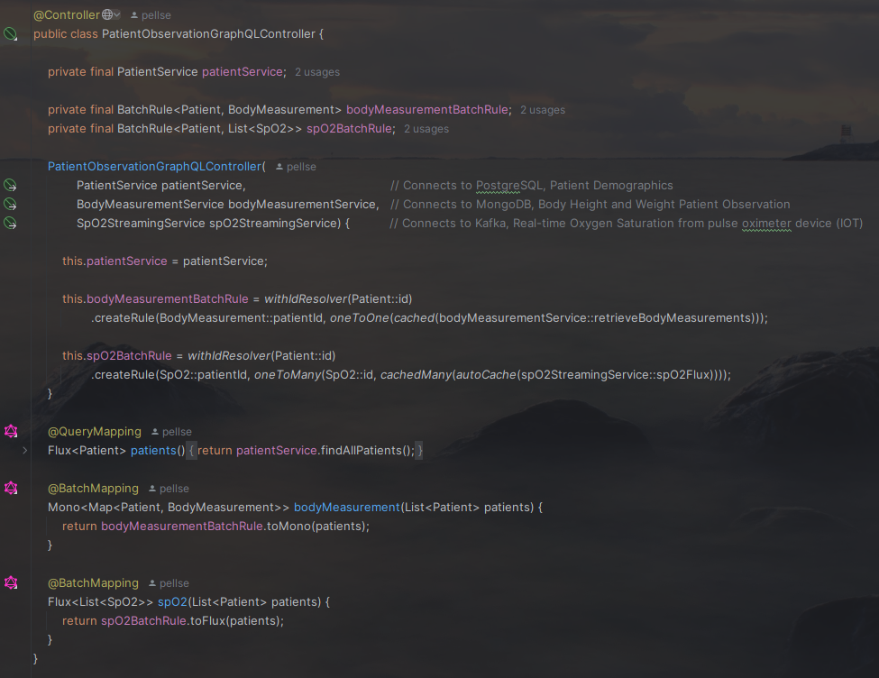

# assembler-example

This repository showcases the integration of the [Assembler Library](https://github.com/pellse/Assembler) with [Spring GraphQL](https://spring.io/projects/spring-graphql) to aggregate data from multiple sources in a single query. This combination serves as a powerful tool for implementing API composition, facilitating efficient data retrieval while reducing the complexity of client-side data aggregation.

## Scenario
This example demonstrates a basic healthcare application for simulating monitoring patient data. Three services are implemented: the Patient Service for retrieving patient demographics from PostgreSQL, the Body Measurement Service for retrieving height and weight from MongoDB, and the SpO2 Streaming Service for real-time oxygen saturation monitoring from a pulse oximeter device via Kafka. A GraphQL Controller is implemented in `PatientObservationGraphQLController` to aggregate data from these services.

## Assembler Library + Spring GraphQL for API Composition and Solve the N + 1 Query Problem

The new `BatchRule` API from the Assembler Library seamlessly integrates with the Spring GraphQL [@BatchMapping](https://docs.spring.io/spring-graphql/docs/current/reference/html/#controllers.batch-mapping) mechanism, as shown in the usage example found in `PatientObservationGraphQLController`. Additionally, this example showcases additional features of the Assembler Library, including:
- caching of service invocations using the [cached()](https://github.com/pellse/assembler#reactive-caching) function
- caching of real-time data streams with the [autoCache()](https://github.com/pellse/assembler#auto-caching) function.



## How to Run the Application
- Make sure Docker is installed
- Run the `main` method in *src\test\java\io\github\pellse\example\PatientMonitoringApplicationTest.java*
  - Or execute the *bootTestRun* Gradle Task

This repository takes advantage of the new [Spring Boot 3.1.0 Testcontainers support](https://www.atomicjar.com/2023/05/spring-boot-3-1-0-testcontainers-for-testing-and-local-development/) for local development.

## How to Use the Application
- Open a browser at http://localhost:8080/graphiql?path=/graphql
- Run the following GraphQL Query:
```js
{
  patientObservations: patients {
    name
    bodyMeasurement {
      height_cm: height
      weight_kg: weight
      time
    }
    oxygenSaturation: spO2 {
      spO2Value
      time
    }
  }
}
```
Periodically rerun the query, the number of `SpO2` values for each patient should increase.


## What's Next

This repository will be updated in the near future with an example of integrating the Assembler Library with Spring GraphQL using the [@SubscriptionMapping](https://docs.spring.io/spring-graphql/docs/current/reference/html/#controllers.schema-mapping) annotation. This integration will demonstrate how to augment a data stream connected to the client via WebSockets.

## Tech stack
- [Assembler Library](https://github.com/pellse/Assembler)
- [Spring GraphQL](https://spring.io/projects/spring-graphql)
- Spring Data
  - [Reactive PostgreSQL (R2DBC)](https://spring.io/projects/spring-data-r2dbc)
  - [Reactive MongoDB](https://spring.io/projects/spring-data-r2dbc)
- [Spring Cloud Function](https://spring.io/projects/spring-cloud-function)
  - [Spring Cloud Stream](https://spring.io/projects/spring-cloud-stream)
    - Reactive Kafka
- [Testcontainers](https://www.testcontainers.org/)